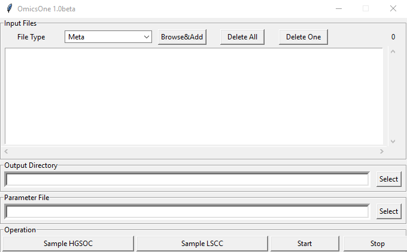

# OmicsOne
OmicsOne:  Associate Omics Data with Phenotypes in One-Click

Contributors: Yingwei Hu, Minghui Ao

# Installation locally on Windows
OmicsOne is run in Python 3.8.
You can install it using pip from pypi.org if you have installed Python 3.8.
```
$ pip install omicsone
```
You can also download the wheel file from this repo to install it.
```
$ pip install omicsone-1.1.6-cp38-cp38m-win_amd64.whl
```
All the package dependencies will be installed automatically.
If OmicsOne has been install successfully, it can be started by the following command.
```
$ omicsone-runserver
```
<br>
Users can click 'Sample HGSOC' or 'Sample LSCC' to launch the test data sets, and click the 'Start' button to run the analysis.

# Installation of Anaconda (Optional)
OmicsOne was developed under conda virtual environment. 
Here is a step by step tutorial for install Anaconda 3 and run OmicsOne under conda environment.
As OmicsOne has been upgraded to Python 3.8 and stop supporting of Python 3.6. Please note all the followintg "3.6" should be changed to "3.8" in the screen shots.
The video tutorial can be found in https://youtu.be/HOGLNm02qCk.
You can also choose to install OmicsOne in an existed Python 3.8 environment (Skip Step.1-4) without install Anaconda 3.
1. Download and install Anacoda 3 (https://www.anaconda.com/products/individual), and scroll down to the bottom of the front page <br>
<br>
<br>
<br>
<br>
Select folder you want to install <br>
<br>
Add Anaconda 3 to PATH (optional) <br>
<br>
<br>
Wait until it is completed <br>
<br>
<br>
2. Install conda virtual environment for Python 3.8
Click Anaconda Prompt (anaconda3) to open the command line window. <br>
 <br>
type 'conda create --name omicsone python=3.8' to install python 3.8 environment named as 'omicsone'<br>
 <br>
Select 'y' for 'Proceed ([y]/n)?' and wait until the Python 3.8 environment of OmicsOne is established.<br>
<br>
<br>
3. Clone or download OmicsOne folder in your local computer<br>
In this demo, the root folder path of OmicsOne is C:\Users\Yingwei\Documents\Github\OmicsOne<br>
<br>
4. Activate the Python 3.8 environment named as 'omicsone' and change directory to the root folder of OmicsOne.<br>
type 'conda activate omicsone' to activate Python 3.8 environment<br>
<br>
